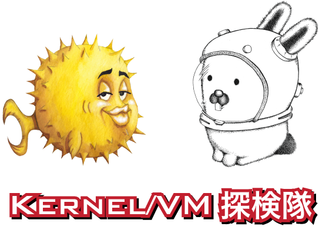

# Kernel/VM探検隊

（サイトのリニューアル中です）

## 目的

カーネルや仮想マシンなどを代表とした、低レイヤーな話題でわいわい盛り上がるマニアックな勉強会です。\
低レイヤー技術を勉強している人達の交流の場に出来ればと思います。

## 内容

Linux・\*BSD・Plan9・Windowsなどの各種OSのデベロッパー／ヘビーユーザー、セキュリティ界隈の方々、競技プログラミング方面や難読化プログラミングが趣味な方、VMMの研究者の方、社宅でBGP組みたい方、などなど様々な分野で御活躍中の方々に幅広くご参加頂いております。

発表内容は参加者の人種に偏りがありますので若干OS・VMM・ハードウェア・プログラミング言語などの話題に偏りがちですが、一応ノージャンルという事で、楽しければなんでもOK！というスタンスです。

是非貴方も発表しに来て下さい。

初参加なのでまずはLTをやってみよう！というのを推奨しています。

## 必要な知識

C言語やアセンブリ言語への理解、ハードウェアに関する基礎知識が有った方が望ましいですが、必須ではありません。

ただ、会の雰囲気を掴むために、[今までのまとめ](#todo)にひと通り目を通してくる事を推奨します。

## 公式Twitter

[\@kernelvm](https://twitter.com/kernelvm)

## kernel/vm Discord

下記の招待リンクから参加できます。

関心がある人は誰でも参加可能で、退室も自由です。また、招待リンクはTwitterなどで自由に共有して問題ありません。

https://discord.gg/uxrBFvH6c5

## お問い合わせ

[connpass 経由でお問い合わせください](https://kernelvm.connpass.com/)

## Facebookグループ

あまりメンテナンスされていません。

[カーネル／VM探検隊](https://www.facebook.com/groups/344405922308688/648277151921562/)

[カーネル／VM勉強会](https://www.facebook.com/groups/397488786977785/)
